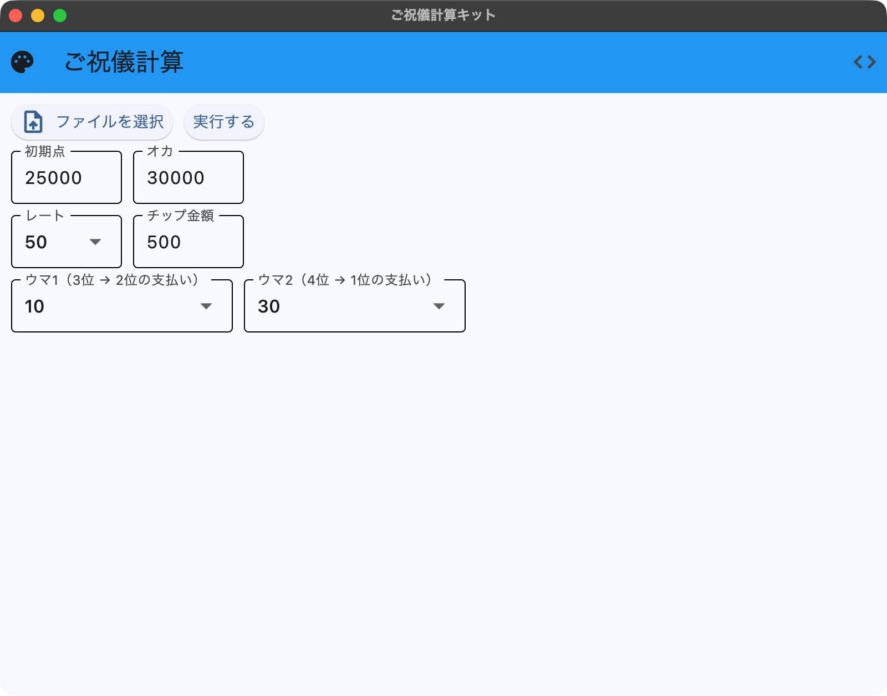
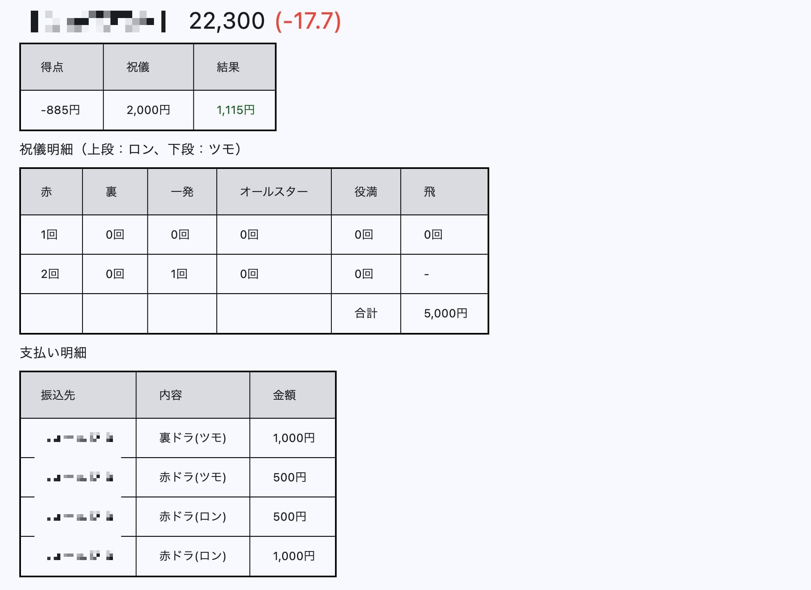

# 麻雀精算計算ツール 

## 使い方
### 1. 牌譜保存
・[牌譜保存方法](https://wikiwiki.jp/majsoul-api/%E7%89%8C%E8%AD%9C%E3%82%92%E3%83%95%E3%82%A1%E3%82%A4%E3%83%AB%E3%81%AB%E4%BF%9D%E5%AD%98%E3%81%99%E3%82%8B%E3%81%AB%E3%82%83)

上記のサイトを参考にご自身で牌譜をダウンロードしてください。  
こちらのツールからは牌譜のダウンロードはできません。

### 2. 保存した牌譜読み込み

ツールを起動すると初期画面が表示されます。  
必要に応じて値を変更してください。  
**「ファイルを選択」** ボタンを押下して `1. 牌譜保存` で保存したtxtファイルを選択します。

### 3. 計算結果表示画面

牌譜を読み込むと、4人分の収支が表示されます。

#### テーブル1: 総合得点
総合の収支金額が表示されます。  

#### テーブル2: 祝儀明細
祝儀の動きの詳細が一覧となっています。  
1行目はロン、2行目はツモです。   
ツモの場合は同卓している他の全員からチップを貰う想定です。  

なので計算式は  
`(1段目の合計 + (2段目の合計 x 3)) x チップ金額`  
となります。

【祝儀の種類】
| 種類         | 枚数 | 
| ------------ | ---- | 
| 赤ドラ       | 1枚  | 
| 裏ドラ       | 1枚  | 
| 一発         | 1枚  | 
| オールスター | 5枚  | 
| 役満（ツモ） | 5枚  | 
| 役満（ロン） | 10枚 | 

#### テーブル3: 支払い明細
誰に対してチップを支払うべきかが一覧になっています。  
ロンと書かれている場合は放銃した場合、ツモと書かれているのは他家がツモった場合です。

## 免責事項
オープンソースのツールですので、PCで起動するのが怖い方はソースコードを確認した上で自分でビルドしてください。  
大量の牌譜保存などによる雀魂のアカウント制限などにはお気をつけください。
